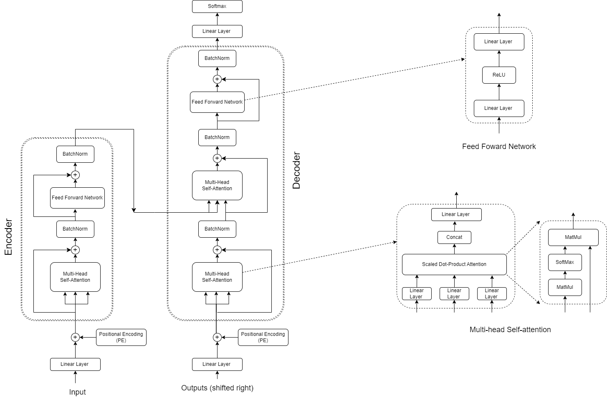
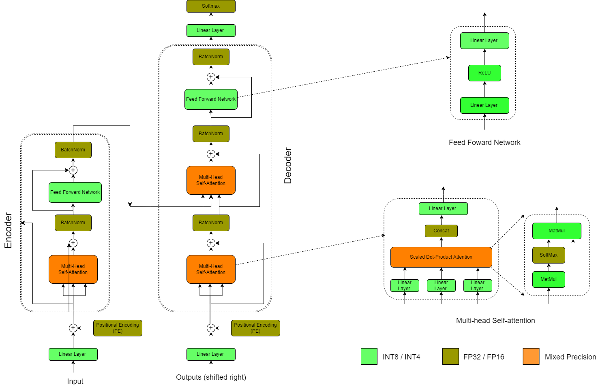

# llm-quantization
Comparison of different LLM Quantization algorithms

LLM Architecture

The general architecture of transformer is shown below: 

Quantization precision mapping of transformer

# Results

# AWQ

OPT Model:

| PPL             | OPT-1.3B | OPT-2.7B | OPT-6.7B | OPT-13B |  
|-----------------|----------|----------|----------|---------|  
| FP16            |  14.62   |  12.47   | 10.86    | 10.13   |
| AWQ (INT4-g128) |  14.92   |  12.70   | 10.92    | 10.22   |

Llama-2 Model:

| PPL             | Llama-2-7B | Llama-2-13B | Llama-2-30B | Llama-2-70B |  
|-----------------|------------|-------------|-------------|-------------|  
| FP16            |   5.47     |  4.88       |             |    3.32     |
| AWQ (INT4-g128) |   5.6      |  4.97       |             |    3.41     |

# SmoothQuant

OPT Model: perlexity metric

| PPL               | OPT-1.3B | OPT-2.7B | OPT-6.7B | OPT-13B |  
|-------------------|----------|----------|----------|---------|  
| FP16              |  14.62   |  12.47   |  10.86   | 10.13   |
| SmoothQuant(A8W8) |  14.82   |  12.50   |  10.86   | 10.14   |

Llama-2 Model: perplexity metric

| PPL             | Llama-2-7B | Llama-2-13B | Llama-2-30B | Llama-2-70B |  
|-----------------|------------|-------------|-------------|-------------|  
| FP16            |   5.47     |  4.95       |             |    3.32     |
| AWQ (INT4-g128) |   5.51     |  4.92       |             |    3.35     |