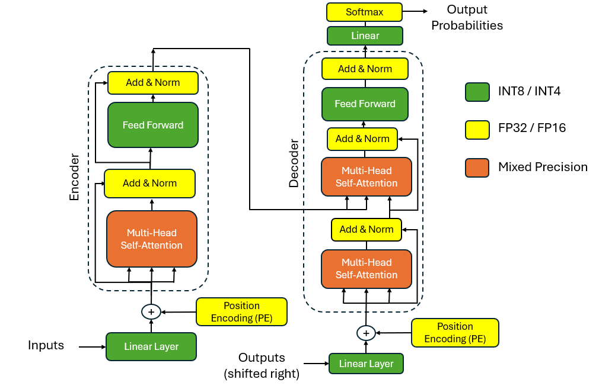
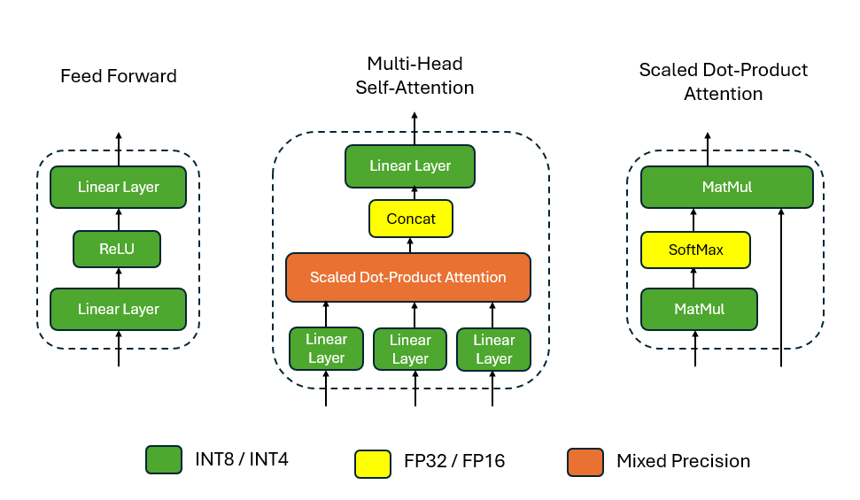

# llm-quantization
Comparison of different LLM Quantization algorithms

## LLM Architecture

The general architecture of transformer is shown below with quantization precision mapping. 

# Results

- Perplexity is a commonly used metric for evaluating language models, including large language models (LLMs)
- Perplexity is a measure of how well a language model predicts a set of words.
- A lower perplexity score means the model makes better predictions.
- In these tests WikiText-2 dataset is used, which consists of a diverse collection of Wikipedia articles

# GPTQ

- Perplexity measurement on the wikitest-2 database on different sizes of the OPT / Llama-2 models
- Quantization configuration (INT4-g128):
  - INT4 : Weight quantization precision
  - g128: Using 128 group size
- These results are generated using the AutoGPTQ library

OPT Model:

| PPL                  | OPT-1.3B | OPT-2.7B | OPT-6.7B | OPT-13B |  
|----------------------|----------|----------|----------|---------|  
| FP16                 |  14.62   |  12.47   | 10.86    | 10.13   |
| GPTQ (INT4-g128)     |  16.15   |  12.84   | 11.05    | 10.21   |

Llama-2 Model:

| PPL                  | Llama-2-7B | Llama-2-13B | Llama-2-70B |
|----------------------|------------|-------------|-------------|
| FP16                 |   5.47     |  4.88       |    3.32     |
| GPTQ (INT4-g128)     |   5.87     |  4.97       |    3.52     |

# AWQ

- These results are generated using the AWQ implementation [3]
- Quantization configuration:
  - INT4: Weight quantization precision
  - g128: Uses 128 group size

OPT Model:

| PPL             | OPT-1.3B | OPT-2.7B | OPT-6.7B | OPT-13B |  
|-----------------|----------|----------|----------|---------|  
| FP16            |  14.62   |  12.47   | 10.86    | 10.13   |
| AWQ (INT4-g128) |  14.92   |  12.70   | 10.92    | 10.22   |

Llama-2 Model:

| PPL             | Llama-2-7B | Llama-2-13B | Llama-2-70B |
|-----------------|------------|-------------|-------------|
| FP16            |   5.47     |  4.88       |    3.32     |
| AWQ (INT4-g128) |   5.6      |  4.97       |    3.41     |

# SmoothQuant

- SmoothQuant[2] shows reliable results with 8-bit quantization
- Quantization Configuration:
  - W8: Weight quantization precision
  - A8: Activation quantization precision

OPT Model: perlexity metric

| PPL               | OPT-1.3B | OPT-2.7B | OPT-6.7B | OPT-13B |  
|-------------------|----------|----------|----------|---------|  
| FP16              |  14.62   |  12.47   |  10.86   | 10.13   |
| SmoothQuant(A8W8) |  14.82   |  12.50   |  10.86   | 10.14   |

Llama-2 Model: perplexity metric

| PPL             | Llama-2-7B | Llama-2-13B | Llama-2-70B |
|-----------------|------------|-------------|-------------|
| FP16            |   5.47     |  4.95       |    3.32     |
| AWQ (INT4-g128) |   5.51     |  4.92       |    3.35     |

